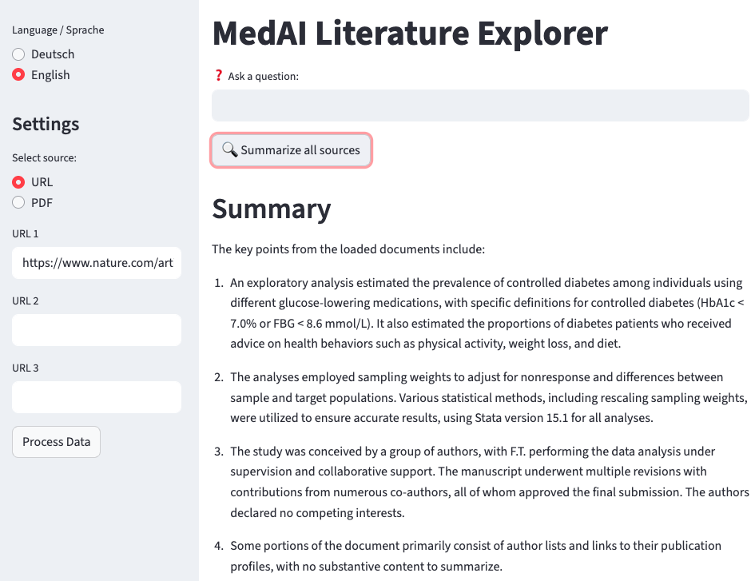

📌 Finales README.md
# MedAI Literatur Explorer 🧠📚

## 📷 Screenshots

### Startansicht


---

Ein **KI-gestütztes Recherche-Tool** für wissenschaftliche Publikationen und Artikel.  
Mit Hilfe von **LangChain, FAISS, Streamlit und OpenAI GPT** können Nutzer medizinische Publikationen (PDFs oder URLs) hochladen und:

- **Fragen stellen** (Q&A über die Inhalte)  
- **Zusammenfassungen generieren**  
- **Quellenangaben einsehen**  

Dieses Projekt zeigt, wie Large Language Models (LLMs) mit semantischer Suche (Vektordatenbanken) kombiniert werden können, um **wissenschaftliche Recherche effizienter** zu machen.

---

## 🚀 Features
- 📂 Unterstützung von **URLs** und **PDFs**  
- 🔍 **Q&A-Modus** → Beantwortung spezifischer Fragen aus den Quellen  
- 📝 **Zusammenfassung** aller Dokumente auf Knopfdruck  
- 🌐 **Sprachumschaltung (Deutsch / Englisch)**  
- ⚠️ **Fallback-Antwort**: Keine „Ich weiß es nicht“-Antworten mehr, sondern klare Hinweise  
- 🎯 Beispielquelle (Ärzteblatt-Artikel) direkt vorinstalliert  

---

## 🛠️ Technologien
- [Streamlit](https://streamlit.io/) – Web-App-Framework  
- [LangChain](https://www.langchain.com/) – LLM-Orchestrierung  
- [FAISS](https://github.com/facebookresearch/faiss) – Vektordatenbank  
- [OpenAI GPT](https://platform.openai.com/) – Sprachmodell  
- Python, dotenv, NumPy  

---

## 📦 Installation

### 1. Repository klonen
```bash
git clone https://github.com/CZhakshylykova/medai-literature-explorer.git
cd medai-literature-explorer

2. Abhängigkeiten installieren
pip install -r requirements.txt

3. API Key einrichten

Erstelle eine Datei .env im Projektordner mit folgendem Inhalt:

OPENAI_API_KEY=dein_api_key

4. App starten
streamlit run app.py

💡 Nutzung

Wähle URL oder PDF in der Sidebar.

Lade eine oder mehrere Quellen hoch (z. B. Ärzteblatt-Artikel oder PubMed-PDF).

Stelle deine Frage in das Eingabefeld.

Nutze den Button „Zusammenfassung erstellen“, um eine Übersicht der Dokumente zu erhalten.

📌 Anwendungsbeispiele

🏥 Klinische Forschung: Überblick über mehrere Paper zu einem Thema

💊 Pharma: Vergleich von Studien & Guidelines

🎓 Studierende & Ärzt:innen: Literaturrecherche für Promotionen und Arbeiten

📈 Geplante Erweiterungen

Wordcloud / Schlagwortanalyse der Artikel

Export-Funktion (PDF/Markdown)

Vergleichszusammenfassung mehrerer Quellen

👩‍💻 Autorin

Projekt von Cholpon Zhakshylykova

🎓 Molekulare Medizin (M.Sc.), Medizinstudium

💡 Fokus: Statistik, KI & Medizin

🔗 LinkedIn
 | GitHub

🌍 English Summary

MedAI Literature Explorer is an AI-powered research tool for scientific publications.
Built with Streamlit, LangChain, FAISS, and OpenAI GPT, it allows users to:

Upload PDFs or URLs

Ask questions about the content (Q&A)

Generate summaries

Switch between German/English interface

This project demonstrates how Large Language Models (LLMs) combined with vector search can make scientific research more efficient.